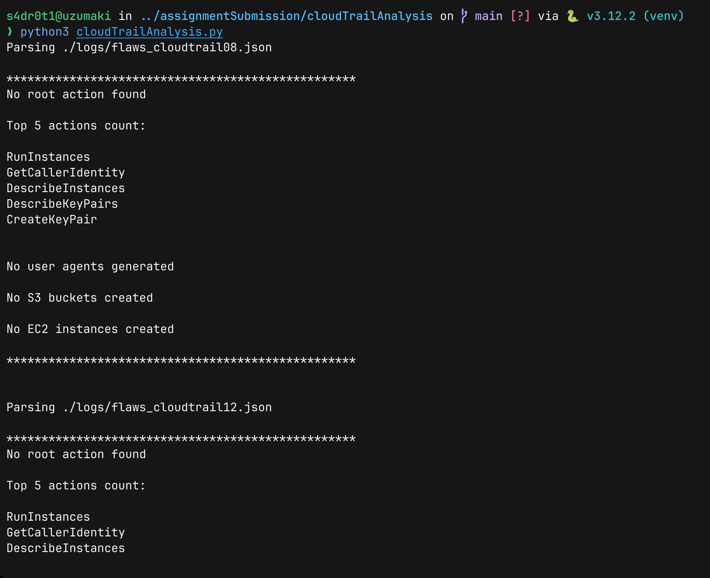
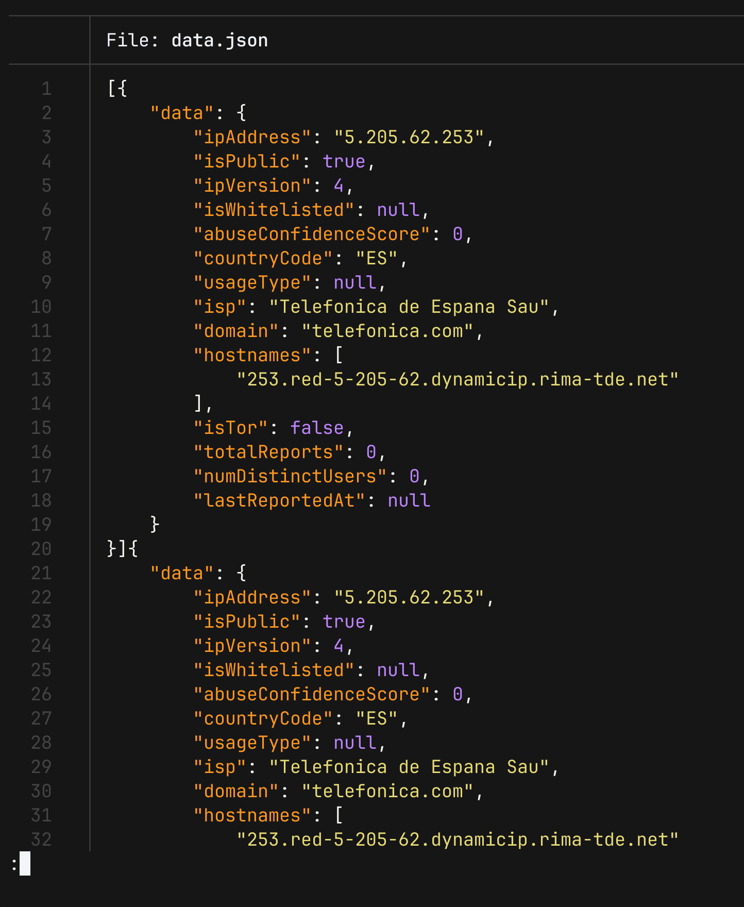

# cloudTrailAnalysis

### Installation

```Bash
# Clone the repository
$ git clone https://github.com/s4dr0t1/assignmentSubmission

# Change directory into assignmentSubmission/cloudTrailAnalysis
$ cd assignmentSubmission/cloudTrailAnalysis/

# Setup a Python virtualenv
$ python3 -m venv venv

# Activate the virtualenv
$ source venv/bin/activate

# Install the dependencies
$ pip3 install requests

# Create a subdirectory logs and put all your CloudTrail JSON logs there
mkdir logs
```

### Running the code

```Bash
# Make sure you have activated your virtualenv
$ python3 cloudTrailAnalysis.py
```



> [!NOTE]
> Reputation analysis results will be saved in a file called `data.json`

> [!NOTE]
> If you put your logs in a subdirectory whose name is not "logs", you will have to change the `logs_folder` variable in the Python script.


> [!NOTE]  
> I have hard-coded my API key for IP reputation analysis which is of the free tier, if you want to use your own premium key, edit the variable `api_key`


> [!NOTE]  
> I am also doing analysis of only top 1 IP addresses to manage my API hit quota. You can edit the variable `howManyAddressesToCount` to the number of top IP addresses  you want to analyse.
