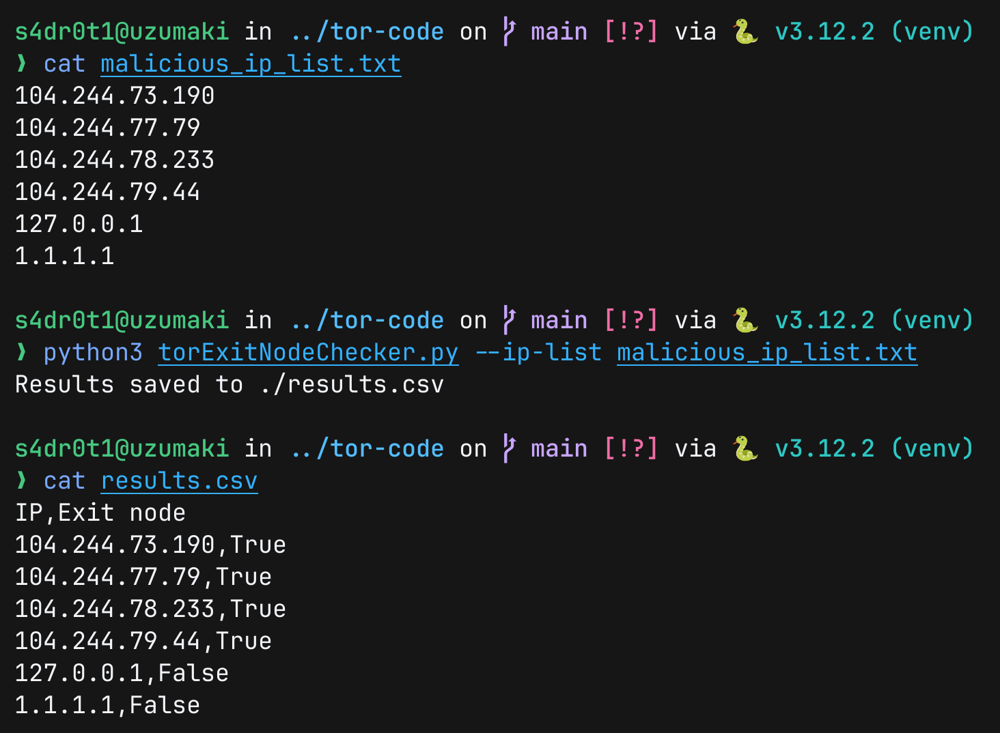

# torExitNodeChecker

### Installation
```Bash
# Clone the repository
$ git clone https://github.com/s4dr0t1/assignmentSubmission

# Change directory into assignmentSubmission/torExitNodeChecker/
$ cd assignmentSubmission/torExitNodeChecker/

# Setup a Python virtualenv
$ python3 -m venv venv

# Activate the virtualenv (according to the shell you use)
$ source venv/bin/activate

# Install the dependencies
$ pip3 install argparse requests

# Seeing the help menu
$ python3 torExitNodeChecker.py

usage: torExitNodeChecker.py [-h] [--ip IP] [--ip-list IP_LIST]

Check if an IP address(es) is a Tor exit node

options:
  -h, --help         show this help message and exit
  --ip IP            Check a single IP address
  --ip-list IP_LIST  Check a list of IP addresses specified through a text file
```

### Running the code
- Specifying an IP address using `--ip`


- Specifying a list of IP addresses by using `--ip-list`

